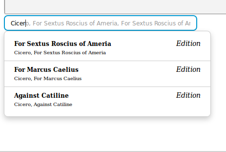
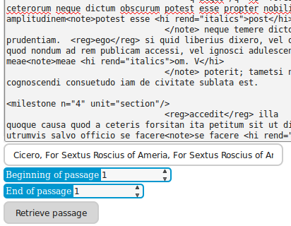

jQuery CTS Typeahead
===

[Back to the index](../../README.md)

If you are looking for the CTS Search field, this is here. -If you are looking for droids, these are not the one you are looking for.

## Description

This plugins aims to provide a solid selector for passage or text in your front-end. Giving it a simple CTS API endpoint and one inventory to call, this plugin will generate for you a search box where your user can simply type to find !





To use it, you will need to use compressed (or uncompressed) `cts.js`, 

```html
<!DOCTYPE html>
<html>
<head>
  <title>An example</title>
  <script type="text/javascript" src="../build/cts.min.js"></script>
  <script type="text/javascript" src="../build/i18n/en.min.js"></script>
  <script type="text/javascript" src="/path/to/jQuery.js"></script>
  <script type="text/javascript" src="/path/to/jQuery.js"></script>
  <script type="text/javascript" src="/path/to/handlebars.js"></script>
  <script type="text/javascript" src="/path/to/typeahead.bundle.js"></script>
  <script type="text/javascript" src="../build/jquery.cts.typeahead.min.js"></script>
  <link rel="stylesheet" type="text/css" href="../src/css/jquery.cts.typeahead.css" />

</head>
<body>

<script type="text/javascript">
  $(document).ready(function() {
    $(".target").ctsTypeahead({
      "endpoint" : "URL/exist/rest/db/xq/CTS.xq?",
      "version" : 3,
      "inventories" : {
        "annotsrc" : "Nice label for annotsrc",
        "pilots" : "Pilots"
      }
    });
  });

</script>
</body>
</html>
```

## Events

| Name                         | Description
|------------------------------|---------------------------------
| cts-passage:retrieving       | Before retrieving the passage, this event is triggered on the retrieve_scope, aka. settings["retrieve_scope"] or on the element targeted at the init phase (`$(".target")` in the example)
| cts-passage:retrieved        | After retrieving the passage, this event is triggered on the retrieve_scope, aka. settings["retrieve_scope"] or on the element targeted at the init phase (`$(".target")` in the example)
| cts-passage:urn-updated      | When urn value has been updated
| cts-passage:urn-work         | When a work urn has been chosen
| cts-passage:urn-passage      | When a work & passage urn has been chosen
| cts-passage:passage-error    | Retrieved passage is empty
| cts-passage:retrieving-error | An HTTP error occured during retrieval

### Event data

- `cts-passage:urn-updated` pass a CTS.repository.prototypes.Text sub-instance (Edition, Translation, etc.)
- `cts-passage:retrieved` pass a CTS.text.Passage instance

## Basic parameters

| Key            | Type              | Default | Required | Description                                                        |  
| -------------- | ----------------- | ------- | -------- | ----------------                                                   |  
| endpoint       | string            | ""      | Yes      | CTS API endpoint (URI) finishing with "?"                          |  
| css            | object            | {}      |          | See below [CSS custom classes](#css-custom-classes)                |  
| version        | int               | 3       |          | Version of the CTS implementation (3 or 5)                         |  
| inventories    | object            | {}      | Yes      | Object where keys are inventory's name and value are label to show |  
| retrieve       | boolean or string | false   |          | If set to true, replace the content of plugin target by the plugins data on clicking retrieve. If it's a string, will use string as a jQuery selector to fill with retrieved passage |
| retrieve_scope | null or string | null                             |  | Element to retrieve from retrieved passage |  
| passage        | boolean        | true                             |  | Show a passage selector                    |  
| theoretical    | boolean        | false                            |  | Show theoretical works                     |  
| tokenizer      | function       | Bloodhound.tokenizers.whitespace |  | [Function to parse the query](#tokenizer). |  
| languages      | Array          | []                               |  | If not empty, only languages code in the Array will be shown |  

## Tokenizer

The tokenizer parameter is a shortcut to defined the tokenizer of the [Bloodhound](https://github.com/twitter/typeahead.js/blob/master/doc/bloodhound.md) object. The function should have the following parameters and returns

```javascript
/**
 * Tokenize a query string into readable data for Bloodhound
 *
 * @param  {string}  query  The query string typed in the input of typeahead
 * @return {Array}          A list of string
 *
 */
function tokenizer(query) {
  return query.split(" ");
}
```

*eg* : You can use this ctsTypeahead param to automatically filter on language for example :

```javascript
/**
 * Tokenize a query string into readable data for Bloodhound and accept only given language
 *
 * @param  {string}  query  The query string typed in the input of typeahead
 * @return {Array}          A list of string
 *
 */
function tokenizer(query) {
  query = Bloodhound.tokenizers.whitespace(query);
  query.push("lang:grc");
  return query;
}
```

## CSS custom classes

Because so many plugins force you to dig the code or extend your already existing CSS classes, we thought it might be cool to give you the availability to add your own classes to **all the generated DOM elements !**. To do so, when passing your `option` object to the constructor, add the `css` dictionary, where keys are identifier described below and value a list of classes (**WITHOUT THE DOT**).

|      Identifier           |  Automatic class                     | Description
|---------------------------|--------------------------------------|--------------
| container                 | `["cts-selector"]`                   | Container for all the generated DOM
| retrieve-button           | `["cts-selector-retriever"]`         | `<button />` used to retrieve passage
| retrieve-button-container | `[]`                                 | `<div />` containing previous button
|                           |                                      |
| citation                  | `["cts-selector-citation"]`          | `<div />` containing beginning or end passage selection's containers
| citation-container        | `["cts-selector-passage-container"]` | `<div />` containing beginning or end passage selection's inputs
| citation-container-legend | `["cts-selector-passage-label"]`     | `<span />` for the given div containing identifier for beginning or end
| citation-input            | `["cts-selector-passage-number"]`    | `<Input />` for passage selection